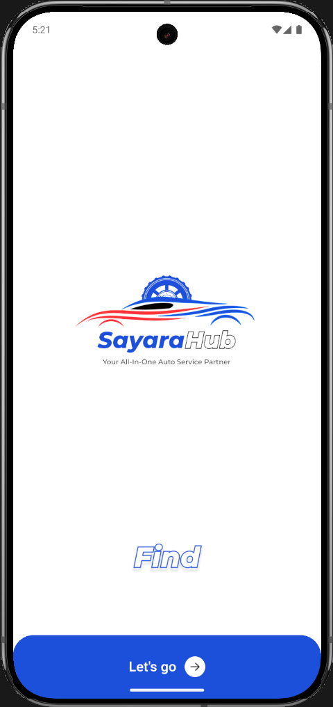
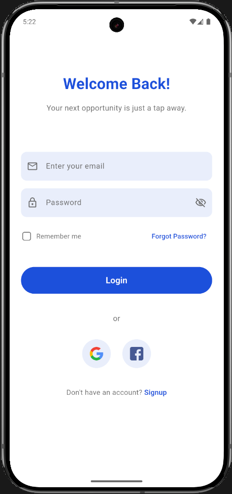
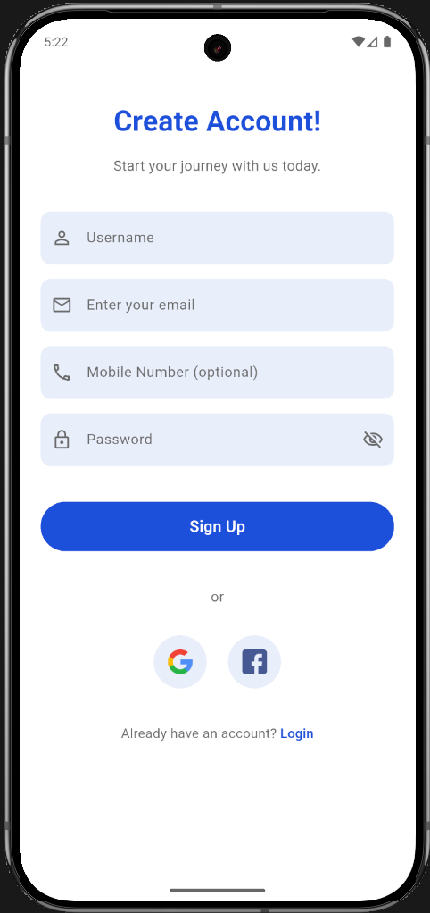
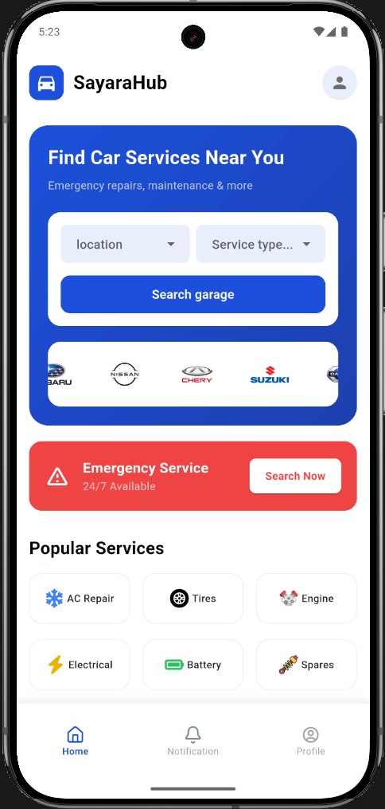
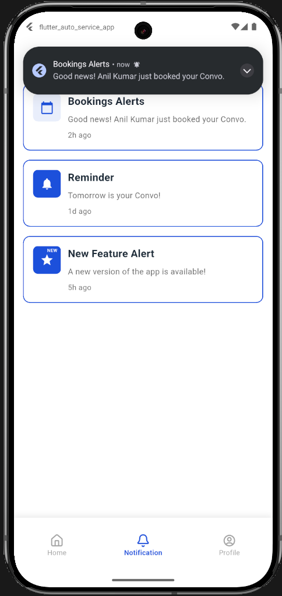
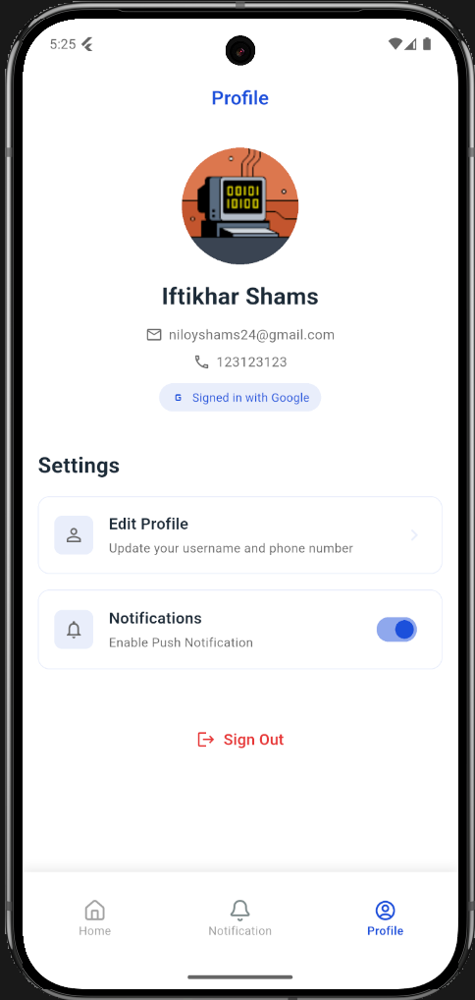

  

<h1 align="center">Flutter Auto Service App</h1>

  Welcome to <strong>Flutter Auto Service App</strong> — a comprehensive mobile solution designed to connect vehicle owners with nearby auto service centers and garages. This modern application streamlines the process of finding, booking, and managing automotive repair and maintenance services with an intuitive user interface and robust backend infrastructure.

<h2> Overview</h2>

  The Flutter Auto Service App addresses the common challenge of finding reliable auto repair services. Built with Flutter and powered by Firebase, the application provides users with a seamless experience for discovering top-rated garages, browsing popular automotive services, and managing their service appointments. The app features a complete authentication system, real-time notifications, and personalized user profiles, making vehicle maintenance management effortless.

<h2> Key Features</h2>

<h3> Authentication & User Management</h3>
<ul>
  <li><strong>Multiple Sign-In Options</strong> — Email/Password, Google Sign-In, and Facebook authentication</li>
  <li><strong>Secure Registration</strong> — User sign-up with email verification and password validation or using Google Account</li>
  <li><strong>Password Recovery</strong> — Forgot password functionality with email reset link</li>
  <li><strong>Remember Me</strong> — Optional persistent login for convenience</li>
  <li><strong>User Profiles</strong> — Personalized profiles stored in Firebase Firestore with editable information</li>
</ul>

<h3> Home & Service Discovery</h3>
<ul>
  <li><strong>Location-Based Search</strong> — Find auto service centers by location with dropdown selection</li>
  <li><strong>Service Type Filter</strong> — Filter garages by specific services (AC Repair, Tires, Engine, etc.)</li>
  <li><strong>Car Brand Carousel</strong> — Auto-scrolling showcase of supported vehicle brands (Subaru, Nissan, Honda, Hyundai, etc.)</li>
  <li><strong>Popular Services Grid</strong> — Quick access to most requested services with custom icons</li>
  <li><strong>Top Rated Garages</strong> — Display of highest-rated service centers with ratings, reviews, and distance</li>
  <li><strong>Emergency Service</strong> — Prominent emergency hotline access for urgent situations</li>
  <li><strong>Service Status Indicators</strong> — Real-time open/closed status for each garage</li>
</ul>

<h3> Notification System</h3>
<ul>
  <li><strong>In-App Notifications</strong> — Display booking alerts, reminders, and promotional messages</li>
  <li><strong>Push Notifications</strong> — Local push notifications triggered by tapping notification items</li>
  <li><strong>Swipe to Delete</strong> — Interactive slidable notifications with delete functionality on both sides</li>
  <li><strong>Notification Badges</strong> — Visual indicators for new or important notifications</li>
  <li><strong>Custom Icons & Colors</strong> — Category-specific notification styling</li>
</ul>

<h3> Profile Management</h3>
<ul>
  <li><strong>User Information Display</strong> — Show username, email, mobile number, and profile photo</li>
  <li><strong>Edit Profile</strong> — Update user details with real-time Firestore synchronization</li>
  <li><strong>Profile Photo</strong> — Display user avatar from social login or default icon</li>
  <li><strong>Push Notification Toggle</strong> — Enable/disable notification preferences</li>
  <li><strong>Language Selection</strong> — Switch between supported languages</li>
  <li><strong>Terms & Privacy</strong> — Easy access to legal documentation</li>
  <li><strong>Account Management</strong> — Secure logout and account deletion options</li>
</ul>

<h3> UI/UX Excellence</h3>
<ul>
  <li><strong>Modern Material Design</strong> — Clean, professional interface following Material Design guidelines</li>
  <li><strong>Custom Color Scheme</strong> — Consistent branding with primary blue theme</li>
  <li><strong>Splash Screen</strong> — Engaging welcome screen with brand logo and call-to-action</li>
  <li><strong>Bottom Navigation</strong> — Intuitive 3-tab navigation (Home, Notifications, Profile)</li>
  <li><strong>Responsive Layout</strong> — Optimized for various screen sizes and orientations</li>
  <li><strong>Loading States</strong> — Visual feedback during data fetching and processing</li>
  <li><strong>Form Validation</strong> — Real-time input validation with error messages</li>
  <li><strong>Smooth Animations</strong> — Polished transitions and interactive elements</li>
</ul>

<h2> Screenshots & Demo</h2>

Below are screenshots showcasing the application's key screens and features:

<table>
<tr>
<td colspan="3" align="center"><h3>Authentication & Onboarding</h3></td>
<td colspan="3" align="center"><h3>Main Features</h3></td>
</tr>
<tr>
<td align="center">
 
<strong>Splash Screen</strong> 
<em>Welcome screen with branding</em>
</td>
<td align="center">
 
<strong>Sign In</strong> 
<em>Email & social login options</em>
</td>
<td align="center">
 
<strong>Sign Up</strong> 
<em>New user registration</em>
</td>
<td align="center">
 
<strong>Home Screen</strong> 
<em>Service discovery hub</em>
</td>
<td align="center">
 
<strong>Notifications</strong> 
<em>Alert management with push</em>
</td>
<td align="center">
 
<strong>Profile View</strong> 
<em>User information & settings</em>
</td>
</tr>
</table>

<h2>🛠 Tech Stack</h2>

<h3>Frontend Framework</h3>
<ul>
  <li><code>Flutter ^3.10.4</code> — Cross-platform UI framework</li>
  <li><code>Dart</code> — Programming language</li>
</ul>

<h3>Backend & Database</h3>
<ul>
  <li><code>Firebase Core ^4.3.0</code> — Firebase SDK initialization</li>
  <li><code>Firebase Auth ^6.1.3</code> — Authentication service</li>
  <li><code>Cloud Firestore ^6.1.1</code> — NoSQL cloud database</li>
</ul>

<h3>Authentication Providers</h3>
<ul>
  <li><code>google_sign_in ^7.2.0</code> — Google OAuth integration</li>
  <li><code>flutter_facebook_auth ^7.1.2</code> — Facebook login integration</li>
</ul>

<h3>UI Components & Libraries</h3>
<ul>
  <li><code>carousel_slider ^5.1.1</code> — Auto-scrolling brand showcase</li>
  <li><code>flutter_slidable ^4.0.3</code> — Swipeable notification items</li>
</ul>

<h3>Notifications & Permissions</h3>
<ul>
  <li><code>flutter_local_notifications ^18.0.1</code> — Local push notifications</li>
  <li><code>permission_handler ^11.3.1</code> — Runtime permission management</li>
</ul>

<h2> Project Structure</h2>

<pre>
/lib
  ├── main.dart                           # App entry point with Firebase initialization
  ├── firebase_options.dart               # Firebase configuration (auto-generated)
  │
  ├── screens/                            # UI screens
  │   ├── splash_screen.dart              # Initial welcome screen
  │   ├── auth_screen.dart                # Login/Register interface
  │   ├── dashboard_screen.dart           # Bottom navigation controller
  │   ├── home_screen.dart                # Main service discovery screen
  │   ├── notification_screen.dart        # Notification list & management
  │   └── profile_screen.dart             # User profile & settings
  │
  ├── services/                           # Business logic services
  │   ├── auth_service.dart               # Firebase authentication logic
  │   └── notification_service.dart       # Local notification handler
  │
  ├── models/                             # Data models
  │   ├── user_model.dart                 # User data structure
  │   └── notification_item_model.dart    # Notification data structure
  │
  ├── theme/                              # Styling & theming
  │   └── app_colors.dart                 # Color constants & theme
  │
  └── widgets/                            # Reusable widgets
      └── auth_wrapper.dart               # Authentication state wrapper

/assets
  ├── images/                             # App images & logos
  │   ├── splash_image.png
  │   ├── find.png
  │   ├── subaru.png, nissan.png, etc.
  │   └── garage1.png, garage2.png, etc.
  │
  └── icons/                              # Service category icons
      ├── ac_icon.png
      ├── tires_icon.png
      ├── engine_icon.png
      └── battery_icon.png, etc.
</pre>

<h2>⚙️ Installation & Setup</h2>

<h3>Prerequisites</h3>
<ul>
  <li>Flutter SDK (version 3.10.4 or higher)</li>
  <li>Dart SDK</li>
  <li>Android Studio / VS Code with Flutter extensions</li>
  <li>Firebase account with project setup</li>
  <li>Google Cloud Console project (for Google Sign-In)</li>
  <li>Facebook Developer account (for Facebook Login)</li>
</ul>

<h3>Step-by-Step Setup</h3>

<ol>
  <li><strong>Clone the repository:</strong>
    <pre><code>git clone https://github.com/Iftikhar-Shams-Niloy/flutter_auto_service_app.git
cd flutter_auto_service_app</code></pre>
  </li>

  <li><strong>Install Flutter dependencies:</strong>
    <pre><code>flutter pub get</code></pre>
  </li>

  <li><strong>Firebase Configuration:</strong>
    <ul>
      <li>Create a new Firebase project at <a href="https://console.firebase.google.com">Firebase Console</a></li>
      <li>Add Android and iOS apps to your Firebase project</li>
      <li>Download <code>google-services.json</code> (Android) and <code>GoogleService-Info.plist</code> (iOS)</li>
      <li>Place them in respective directories:
        <ul>
          <li>Android: <code>android/app/google-services.json</code></li>
          <li>iOS: <code>ios/Runner/GoogleService-Info.plist</code></li>
        </ul>
      </li>
      <li>Run FlutterFire CLI to generate configuration:
        <pre><code>flutterfire configure</code></pre>
      </li>
    </ul>
  </li>

  <li><strong>Enable Firebase Services:</strong>
    <ul>
      <li>In Firebase Console, enable:
        <ul>
          <li><strong>Authentication</strong>: Email/Password, Google, Facebook</li>
          <li><strong>Cloud Firestore</strong>: Create database in production mode</li>
        </ul>
      </li>
      <li>Update Firestore Security Rules:
        <pre><code>rules_version = '2';
service cloud.firestore {
  match /databases/{database}/documents {
    match /users/{userId} {
      allow read, write: if request.auth != null && request.auth.uid == userId;
    }
  }
}</code></pre>
      </li>
    </ul>
  </li>

  <li><strong>Google Sign-In Setup:</strong>
    <ul>
      <li>Get SHA-1 certificate fingerprint:
        <pre><code>cd android
./gradlew signingReport</code></pre>
      </li>
      <li>Add SHA-1 to Firebase project settings</li>
      <li>Download updated <code>google-services.json</code></li>
    </ul>
  </li>

  <li><strong>Facebook Login Setup:</strong>
    <ul>
      <li>Create app at <a href="https://developers.facebook.com">Facebook Developers</a></li>
      <li>Get App ID and App Secret</li>
      <li>Add Facebook App ID to:
        <ul>
          <li><code>android/app/src/main/res/values/strings.xml</code></li>
          <li><code>android/app/src/main/AndroidManifest.xml</code></li>
        </ul>
      </li>
      <li>Configure OAuth redirect URI in Firebase & Facebook consoles</li>
    </ul>
  </li>

  <li><strong>Android-Specific Configuration:</strong>
    <ul>
      <li>Ensure <code>android/app/build.gradle.kts</code> has core library desugaring enabled</li>
      <li>Update <code>AndroidManifest.xml</code> with notification permissions:
        <pre><code>&lt;uses-permission android:name="android.permission.POST_NOTIFICATIONS"/&gt;
&lt;uses-permission android:name="android.permission.VIBRATE"/&gt;</code></pre>
      </li>
    </ul>
  </li>

  <li><strong>Run the application:</strong>
    <pre><code>flutter run</code></pre>
  </li>
</ol>

<h2>🔧 Configuration Files</h2>

<h3>Android Build Configuration</h3>

The app uses core library desugaring for compatibility with <code>flutter_local_notifications</code>:

<pre><code>// android/app/build.gradle.kts
compileOptions {
    sourceCompatibility = JavaVersion.VERSION_17
    targetCompatibility = JavaVersion.VERSION_17
    isCoreLibraryDesugaringEnabled = true
}

dependencies {
coreLibraryDesugaring("com.android.tools:desugar_jdk_libs:2.0.4")
}</code></pre>

<h3>Firebase Security Rules</h3>

Firestore rules ensure users can only access their own data:

<pre><code>rules_version = '2';
service cloud.firestore {
  match /databases/{database}/documents {
    match /users/{userId} {
      allow read, write: if request.auth != null && request.auth.uid == userId;
    }
  }
}</code></pre>

<h2> Features in Development</h2>

<ul>
  <li> <strong>Booking System</strong> — Schedule appointments with garages</li>
  <li> <strong>Chat Support</strong> — Real-time communication with service centers</li>
  <li> <strong>Review & Rating</strong> — User feedback on service experiences</li>
  <li> <strong>Map Integration</strong> — Google Maps navigation to garages</li>
  <li> <strong>Payment Gateway</strong> — In-app payment for services</li>
  <li> <strong>Service History</strong> — Track past bookings and maintenance records</li>
  <li> <strong>Advanced Search</strong> — Filter by price, distance, ratings, and availability</li>
  <li> <strong>Multi-language Support</strong> — Localization for different regions</li>
</ul>

<h2> Known Issues</h2>

<ul>
  <li>Facebook Login requires proper app review approval for production use</li>
  <li>iOS notifications require Apple Developer Program membership for testing</li>
  <li>Google Sign-In SHA-1 certificate must match for different build variants</li>
</ul>

<h2> Contributing</h2>

Contributions are welcome! Follow these steps to contribute:

<ol>
  <li><strong>Fork this repository</strong></li>
  <li><strong>Create a feature branch:</strong>
    <pre><code>git checkout -b feature/your-feature-name</code></pre>
  </li>
  <li><strong>Make your changes and test thoroughly</strong></li>
  <li><strong>Commit your changes:</strong>
    <pre><code>git add .
git commit -m "Add: description of your feature"</code></pre>
  </li>
  <li><strong>Push to your branch:</strong>
    <pre><code>git push origin feature/your-feature-name</code></pre>
  </li>
  <li><strong>Open a Pull Request</strong> with a clear description of changes</li>
</ol>

<h3>Contribution Guidelines</h3>
<ul>
  <li>Follow Flutter/Dart style guidelines</li>
  <li>Write clear commit messages</li>
  <li>Add comments for complex logic</li>
  <li>Test on both Android and iOS before submitting</li>
  <li>Update documentation if adding new features</li>
</ul>

<h3 align="center">Thank you for exploring <strong>Flutter Auto Service App</strong>! </h3>

Feel free to star ⭐ the repository if you find it helpful and contribute to make it even better!

